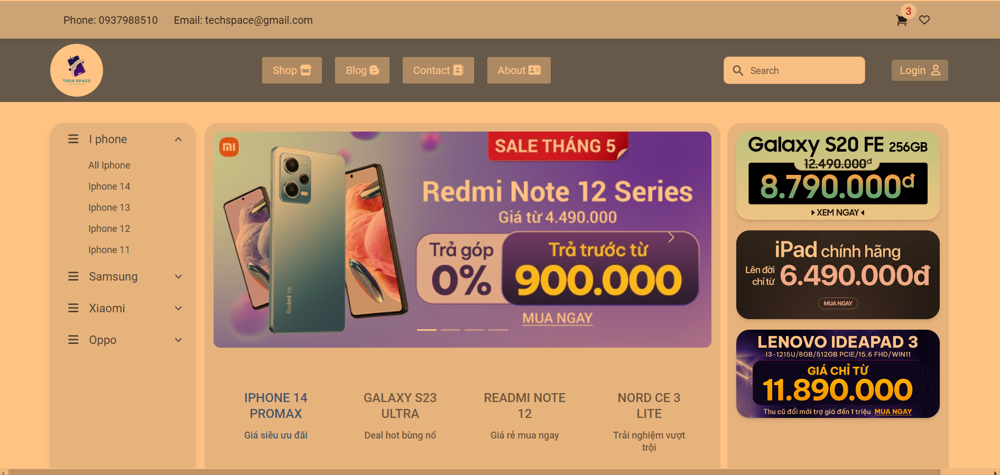
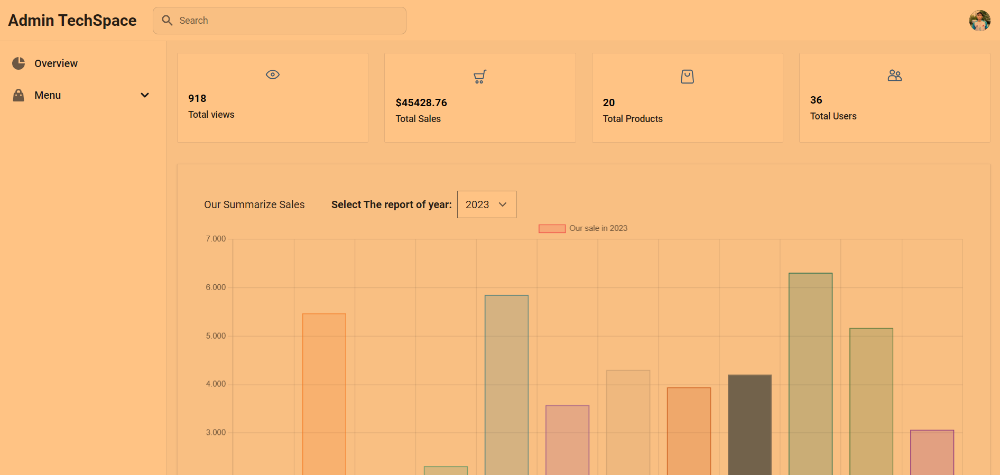

# A Quick Introduction to this project (Techspace)
Overview site page

Overview Admin page

### Links to websites:
+ Backend (render.com): https://fullstack-techspace-es6-api.onrender.com (api)
+ Frontend (nelify.com): 
  + --- (JAVASCRIPT VERSION) https://techspace-phoner.netlify.app/ (main domain)
    admin: https://techspace-phoner.netlify.app/admin/index.html
    site: https://techspace-phoner.netlify.app/site/index.html
  + --- (TYPESCRIPT VERSION - SINGLE PAGE APPLICATION): 
    site: https://techspace-ts-production.netlify.app/
    admin: https://techspace-ts-production.netlify.app/admin

### Links Repo:
+ Backend Repository: https://github.com/sangtrandev00/techspace-fullstack-es6-api
+ Frontend Repository: 
  + (JAVASCRIPT VERSION): https://github.com/sangtrandev00/frontend-fullstack-es6-techspace-repo
  + (TYPESCRIPT VERSION - SPA ): https://github.com/sangtrandev00/typescript-webpack
### Technology in use: 

+ Frontend: 
  + (JAVASCRIPT VERSION): Html, CSS, Tailwind CSS, Javascript (ECMAScript), Flowbite UI, Tailwind element.
  +  (TYPECRIPT VERSION): OOP principles, Single Page Application, More Form validation
+ Backend: Nodejs( Expressjs), MongoDB (Mongoose), Restful API (JSON)
Library/API: Chartjs (for summarizing data), Datatable, Giao Hang Nhanh API (Get location), Firebase (Google Authentication), SwiperJS (Slider), Node Mailer (to Reset Password), Ckeditor5

### Description: 
- Client: Website about selling phones with functionality like Search, filter (by categories, by price), sort products (by price decrease, increase, latest, oldest), list products, add to cart, create orders, and some core of the website,...
- Admin (Restful API): CRUD categories, products, users. Track orders (view detail, update status). View report of all sold followed by months ( 12 months), all total sales, all views, and all number of products. Summarize orders follow by their status. 
- Authentication:  Login (JWT), Signup, Reset password, Google Login.

- If you want to look thoroughly for more detail just download the source and run for your own.

### Restful API: 
See more detail at 5 Controller in my app.

+ adminCategories.js
+ adminProducts.js
+ adminUsers.js
+ adminOrders.js
+ shop.js
+ auth.js

### How to use this project?
1. Clone this repository
2. + Frontend: `cd frontend` -> `yarn` -> `yarn dev` (development mode)
    + Backend: `cd backed` -> `yarn` -> `yarn start`

### Made by:
https://trannhatsang.com (sangtrandev00)

### Any questions: 
Contact me via Email: nhatsang0101@gmail.com

